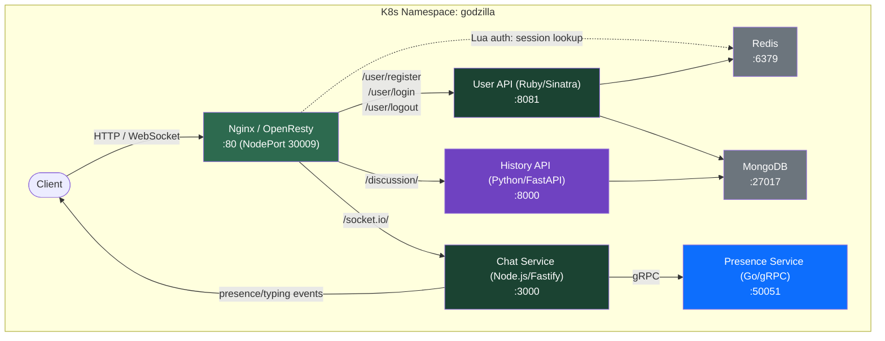

# Godzilla - A Microservice Playground on Kubernetes

A deliberately over-engineered session-based API gateway on Kubernetes, built with OpenResty (Lua), Ruby, Node.js, Go gRPC, Python, MongoDB and Redis. This project exists primarily as a learning exercise to explore microservice patterns, container orchestration, multi-language service integration, and cloud deployment with Terraform and GCP. Built with AI assistance.

```ascii
⠀⠀⠀⠀⠀⠀⠀⠀⠀⠀⠀⠀⠀⠀⠀⠀⠀⠀⠀⠀⠀⠀⠀⠀⠀⠀⠀⠀⠀⠀⠀⠀⠀⣠⣤⡀⠀⠀⠀
⠀⠀⠀⠀⠀⠀⠀⠀⠀⠀⠀⠀⠀⠀⠀⠀⠀⠀⠀⠀⠀⠀⠀⠀⠀⠀⠀⠀⠀⠀⣠⣶⣿⣿⣿⡟⠀⠀⠀
⠀⠀⠀⠀⠀⠀⠀⠀⠀⠀⠀⠀⠀⠀⠀⠀⠀⠀⠀⠀⠀⠀⠀⠀⠀⠀⠀⠀⢀⣾⣿⣿⣿⣿⣿⣀⣀⠀⠀
⠀⠀⠀⠀⠀⠀⠀⠀⠀⠀⠀⠀⠀⠀⠀⠀⠀⠀⠀⠀⠀⠠⣦⣄⣤⣤⣶⣿⣿⣿⣿⣿⣿⣿⣿⣿⣿⠇⠀
⠀⠀⠀⠀⠀⠀⠀⠀⠀⠀⠀⠀⠀⠀⠀⠀⠀⠀⣀⣠⣤⣠⣿⣿⣿⣿⣿⣿⣿⣿⣿⣿⣿⣿⡟⠁⠀⠀⠀
⠀⠀⠀⠀⠀⠀⠀⠀⠀⠀⠀⠀⠀⠀⠀⣀⣀⣀⣙⣿⣿⣿⣿⣿⣿⣿⣿⣿⣿⣿⣿⣿⣿⡟⠀⠀⠀⠀⠀
⠀⠀⠀⠀⠀⠀⠀⠀⠀⠀⠀⠀⠀⠀⠀⢈⣿⣿⣿⣿⣿⣿⣿⣿⣿⣿⣿⣿⣿⣿⣿⣿⣿⠁⠀⠀⠀⠀⠀
⠀⠀⠀⠀⠀⠀⠀⠀⠀⠀⠀⠀⢠⣤⣄⣀⣻⣿⣿⣿⣿⣿⣿⣿⣿⣿⣿⣿⣿⣿⣿⣿⣏⠀⠀⠀⠀⠀⠀
⠀⠀⠀⠀⠀⠀⠀⠀⠀⠀⠀⠀⠐⠿⣿⣿⣿⣿⣿⣿⣿⣿⣿⣿⣿⣿⣿⣿⣿⣿⣿⣿⣿⠀⠀⠀⠀⠀⠀
⠀⠀⠀⠀⠀⠀⠀⠀⠀⠀⠀⠀⣤⣤⣼⣿⣿⣿⣿⣿⣿⣿⣿⣿⣿⣿⣿⣿⣿⣿⣿⣿⡟⠀⠀⠀⠀⠀⠀
⠀⠀⠀⠀⠀⠀⠀⠀⠀⠀⠀⠀⢾⣿⣿⣿⣿⣿⣿⣿⣿⣿⣿⣿⣿⣿⣿⣿⣿⣿⣿⣿⣧⡀⠀⠀⠀⠀⠀
⠀⠀⠀⠀⠀⠀⠀⠀⠀⠀⠀⠀⣬⣝⣿⣿⣿⣿⣿⣿⣿⣿⣿⣿⣿⣿⣿⣿⣿⣿⣿⣿⣿⣿⣄⠀⠀⠀⠀
⠀⠀⠀⠀⠀⠀⠀⠀⠀⠀⠀⠀⣬⣿⣿⣿⣿⣿⣿⣿⣿⣿⣿⣿⣿⣿⣿⣿⣿⣿⠋⠻⢿⣿⣿⣷⣄⠀⠀
⠀⠀⠀⠀⠀⠀⠀⠀⠀⠀⠀⠀⢾⣿⣿⣿⣿⣿⣿⣿⣿⣿⣿⣿⣿⣿⣿⣿⣿⣿⣷⣄⠀⠈⢻⣿⣿⡄⠀
⠀⠀⠀⠀⠀⠀⠀⠀⣀⣤⣾⣿⣿⣿⣿⣿⣿⣿⣿⣿⣿⣿⣿⣿⣿⣿⣿⣿⣿⣿⣿⣿⣷⡤⣼⣿⣿⣷⠀
⠀⠀⠀⠀⠀⢀⣴⣾⣿⣿⣿⣿⣿⣿⣿⣿⣿⣿⣿⣿⣿⣿⣿⣿⣿⣿⣿⣿⣿⣿⣿⣿⣿⣿⣆⠉⠉⠁⠀
⠀⠀⠀⢀⣾⣿⣿⣿⣍⣿⣿⣿⣿⣿⣿⣿⣿⣿⣿⣿⣿⣿⣿⣿⣿⣿⣿⣿⣿⣿⣿⣿⣿⣿⣿⣧⠀⠀⠀
⠀⠀⣴⣿⣿⣿⣿⣼⣿⣿⣿⣿⣿⣿⣿⣿⣿⣿⣿⣿⣿⣿⣿⣿⣿⣿⣿⣿⣿⣿⣿⣿⣿⣿⣿⣿⡆⠀⠀
⢀⣠⣿⣿⣿⣿⣿⣿⣿⣿⣿⣿⣿⣿⣿⣿⣿⣿⣿⣿⣿⣿⣿⣿⡿⠟⠛⠛⣻⣿⣿⣿⣿⣿⣿⣿⠇⠀⠀
⠸⣿⣿⣿⣿⣿⣿⣿⣿⣿⣿⣿⣿⣿⣿⣿⣿⣿⣿⣿⣿⣿⠏⠀⠀⠀⠀⠀⢹⣿⣿⣿⣿⣿⣿⡟⠀⠀⠀
⠘⣿⣿⣿⣿⣿⣿⣿⣿⣿⣿⣿⣿⣿⣿⣿⣿⣿⣿⡿⠏⠁⠀⠀⠀⠀⠀⠀⠈⣿⣿⣿⣿⣿⣿⡇⠀⠀⠀
⠀⠻⣿⣿⣿⣿⣿⣿⣿⣿⣿⣿⣿⣿⣿⣿⡿⠟⠋⠀⠀⠀⠀⠀⠀⠀⠀⠀⠀⣿⣿⣿⣿⣿⣿⣧⣄⠀⠀
⠀⠀⠈⠻⢿⣿⣿⣿⣿⣿⣿⣿⣿⣿⣿⡁⠀⠀⠀⠀⠀⠀⠀⠀⠀⠀⠀⠀⠀⣿⣿⣿⣿⣿⣿⣿⣿⣷⡄
⠀⠀⠀⠀⠀⠀⠀⠸⣿⣿⣿⣿⣿⣿⣿⡿⠆⠀⠀⠀⠀⠀⠀⠀⠀⠀⠀⠀⠀⠈⠉⠉⠉⠉⠉⠉⠉⠉⠁
```

## Architecture



**Nginx/OpenResty** reverse-proxies all traffic and authenticates protected endpoints by checking sessions directly in Redis via Lua.

**Ruby/Sinatra** handles user CRUD and session management, storing users in MongoDB and sessions in Redis.

**Node.js/Fastify** serves real-time WebSocket chat via Socket.io.

**Python/FastAPI** provides chat message history storage and retrieval from MongoDB.

## Auth Flow


## Prerequisites

- [Minikube](https://minikube.sigs.k8s.io/docs/start/) + [kubectl](https://kubernetes.io/docs/tasks/tools/) + [Docker](https://docs.docker.com/get-docker/)
- [HTTPie](https://httpie.io/) (optional, for manual testing)
- [uv](https://docs.astral.sh/uv/) (for integration tests)

## Quick Start

```bash
minikube start
just deploy        # Build images + deploy all services to 'godzilla' namespace
just port-forward  # Forward localhost:8080 → nginx gateway
```

## API

All endpoints go through the Nginx gateway at `localhost:8080`.

| Method | Endpoint | Auth | Description |
|--------|----------|------|-------------|
| POST | `/user/register` | No | Create a user (JSON `username` + `password`) |
| POST | `/user/login` | No | Authenticate, receive session cookie (rate-limited: 10 req/s) |
| POST | `/user/logout` | Session | Delete session, clear cookie |
| WS | `/socket.io/` | Session | Real-time chat (Socket.io) |

### Example

```bash
# Register + login
http POST :8080/user/register username=alice password=secret123
http --session=/tmp/alice.json POST :8080/user/login username=alice password=secret123

# Logout
http --session=/tmp/alice.json POST :8080/user/logout
```

### WebSocket Events
[See](https://github.com/adrienschuler/godzilla/tree/main/services/chat#socket-events)

### CLI Client

[See](https://github.com/adrienschuler/godzilla/tree/main/services/chat#cli-chat-client)

## Project Structure

```text
services/
  accounts/              # Ruby/Sinatra — user CRUD, session auth, bcrypt passwords
  gateway/               # OpenResty — reverse proxy, auth_request, rate limiting
  chat/                  # Node.js/Fastify — Socket.io real-time chat
  presence/              # Go/gRPC — User presence tracking (online/typing)
  history/               # Python/FastAPI — Chat message history (MongoDB)
k8s/
  redis.yaml             # Redis deployment + ClusterIP service
  mongodb.yaml           # MongoDB deployment + ClusterIP service
  accounts.yaml          # Accounts deployment + ClusterIP service
  gateway.yaml           # Gateway deployment + NodePort service (30009)
  chat.yaml              # Chat deployment + ClusterIP service
  presence.yaml          # Presence deployment + ClusterIP service
  history.yaml           # History deployment + ClusterIP service
  jobs/seed-job.yaml     # MongoDB seed job (sample users + messages)
tests/                   # pytest integration tests (register → login → access → logout)
scripts/seed.py          # MongoDB seeding script (users + discussions)
terraform/               # GKE infrastructure (VPC, GKE cluster, Artifact Registry)
justfile                 # Orchestration (see below)
```

## Just Targets

| Target | Description |
|--------|-------------|
| `just deploy` | Build all images and deploy everything (includes seeding) |
| `just test` | Run unit + integration tests |
| `just unit-test` | Run unit tests only |
| `just integration-test` | Run integration tests only |
| `just port-forward` | Forward ports: gateway (8080), presence (50051), redis (6379), mongodb (27017), history (8000) |
| `just status` | Show pods and services |
| `just gateway rebuild` | Rebuild + redeploy gateway |
| `just accounts rebuild` | Rebuild + redeploy accounts service |
| `just chat rebuild` | Rebuild + redeploy chat service |
| `just history rebuild` | Rebuild + redeploy history service |
| `just seed` | Seed MongoDB with sample users and discussions |
| `just seed-build` | Build the MongoDB seed Docker image |
| `just seed-deploy` | Deploy the MongoDB seed job to Kubernetes |
| `just clean` | Delete the `godzilla` namespace |

### GKE Deployment

| Target | Description |
|--------|-------------|
| `just gke-setup` | Create GKE cluster with Terraform |
| `just gke-auth` | Configure Docker auth for GCP Artifact Registry |
| `just gke-push` | Build and push all images to Artifact Registry |
| `just gke-deploy` | Deploy to GKE (uses Artifact Registry images) |
| `just gke` | Full GKE deployment (setup + push + deploy) |
| `just gke-teardown` | Destroy GKE infrastructure |


Requires:
- `gcloud` CLI authenticated with a GCP project
- `terraform` for infrastructure provisioning
- `docker buildx` for multi-platform builds
- Project ID configured in `terraform/terraform.tfvars`
