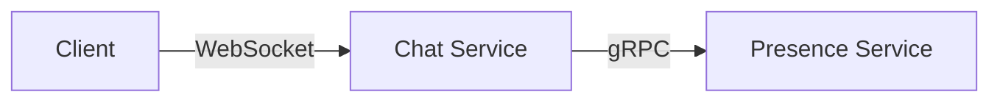

# Chat Service

Real-time WebSocket chat with presence tracking via gRPC.

## API

### WebSocket Endpoints

**`/socket.io/`** - Authenticated WebSocket connection

- Requires: `X-Authenticated-User` header or `auth.username`
- Rejects unauthenticated connections

### HTTP Endpoints

**`GET /health`** - Health check

```json
{ "status": "ok", "service": "chat" }
```

**`GET /presence/online`** - Get online users

```json
{ "online": ["alice", "bob"] }
```

**`GET /presence/typing`** - Get typing users

```json
{ "typing": ["alice"] }
```

### Socket.io Events

**Server → Client:**

- `welcome`: `{ message: string, username: string, timestamp: string }` - Connection welcome message with username
- `message`: `{ from: string, data: { text: string }, timestamp: string }` - Broadcast message
- `presence`: `{ online: string[] }` - Online users list (emitted on connect/disconnect)
- `typing`: `{ users: string[] }` - Users currently typing (broadcast to others)

**Client → Server:**

- `message`: `{ text: string }` - Send chat message
- `typing`: `{ isTyping: boolean }` - Typing indicator

## Architecture



**Components:**

- `src/server.js` - Fastify + Socket.io server with auth
- `src/presence-client.js` - gRPC client for presence service
- `src/session.js` - Session parsing utilities
- `bin/chat-cli.js` - CLI chat client

## Development

```bash
# Install dependencies
npm ci

# Run locally (port 3000)
node src/server.js

# Test
npm test

# Lint & format
npm run lint
npm run format

# Build Docker image
just build
```

**Environment Variables:**

- `PORT`: Server port (default: 3000)
- `PRESENCE_HOST`: Presence service gRPC endpoint (default: localhost:50051)
- `SERVER_URL`: CLI client target URL

## CLI Client

Interactive terminal chat client using saved session files.

```bash
# Connect using session file
npm run chat-cli -- <session-file>

# Override server URL
SERVER_URL=ws://example.com node bin/chat-cli.js session.json
```

**Features:**

- Real-time message display with timestamps
- Typing indicators from other users
- Online user list updates
- Session-based authentication
